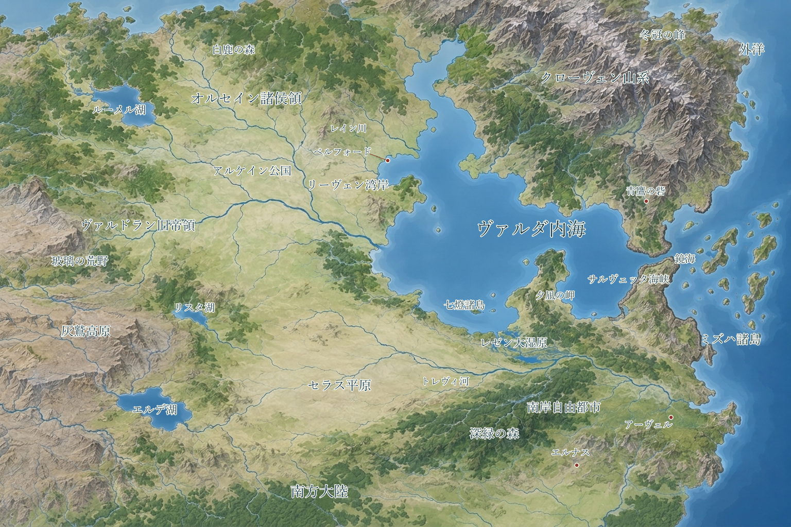

# 百冠（ひゃっかん）と帰還の時代

古い銀貨の顔は、もう誰のものかわからない。それでも秤に載せれば買い物に使える。旅券には自由市の印があり、橋の通行証には公国の印がある。二つをしまう財布は、南の商館から買ったものだ。エスカロンの旅は、こうした小さな境界を毎日越えていく。

暦は842年。灰燼の大嵐で途絶えていた航路に帆が戻り、港の書記は古い地図へ新しい寄港地を書き足している。遠い土地の知らせには、確かな報告も、船乗りの噂も混じる。

## CH-02-sea ヴァルダ内海を囲む世界

[地名を拡大して読む](../assets/maps/world-illustrated-v4.svg)

ヴァルダ内海は、四方を陸塊に抱かれた穏やかな内海である。かつてこの海を統一した大国**ヴァルドラン帝国**――古い碑文や学僧たちが雅語で**「ヴァルドリオン」**と呼ぶ古代の覇権国家――は、この水域を「我らが海（マレ・ノストルム）」と呼びならわした。

帝国を支えたのは二つの心臓部だった。西岸に広がる大河川デルタと軍道網を中心とする帝国中枢、そして内海の南岸一帯に広がる温暖肥沃な大平野（帝国の巨大な穀倉地帯）である。南岸の平野の背後には海はなく、南の奥地へと果てしない乾燥高原やステップ、未知の古代遺構へと続く広大な**南方大陸**が連なっている。帝国はこの南北と東西の物資を、内海を渡る無数の軍船と商船で結びつけ、絶対の覇権を誇っていた。

東の外海へと抜ける出口は、広い大海原ではない。突き出た岬と細長い島々によって、**サルヴェッタ海峡（第一関門）**、その奥の静穏な**鏡海（関門内湾）**、そして外海へ面した**ミズハ双子海峡（第二関門）**という、連なる細い隘路（多重海峡）に絞られている。この天然のチョークポイントを抑えることで、帝国は外海からの侵入を防ぎ、東西を行き交う富から莫大な関税を吸い上げていた。

北東には雲を衝く峻険なクローヴェン山系が聳え、地上の支配者がどれほど入れ替わろうと頑なに炉と槌を守り続けた鉱山組合が操業している。そして西の湾口、リーヴェン湾岸に築かれた自由市ベルフォードは、いまや内海西部の旅立ちの足場となっている。

海は空白ではない。季節風を読む船員、漁場を分ける村、浅瀬を知る水先人がいる。未踏の遺跡と呼ばれる場所でも、近くの住民が薪を採り、祭日に訪れ、危険だから近寄らないと決めていることがある。酒場でその名を口にすれば、薪拾いの道を知る老人や、祭日の歌を覚えた娘に出会うかもしれない。

### 奇矯な一賢者の「地学のうわ言」

セレイン修道院の奥深い古書庫には、かつて異端視された一人の老賢者が残した、風変わりな手記が眠っている。

> 「北東の峻険なる山々は、遥か南の巨大な大陸塊が、気の遠くなるような時間をかけて北の台地を押し上げ、岩肌を揉みくちゃにして隆起させた皺に他ならない。ヴァルダの内海とは、その大地の軋みによって引き裂かれた巨大な地溝に、東の海が流れ込んだものにすぎぬ。そして六十年前の灰燼の大嵐も、傷ついた大地の底から吹き出した火と灰が、狭い海峡という喉元に詰まって内海を渦巻いたのだ……」

もちろん、ベルフォードの酒場で船頭たちにこの話を振れば、誰もが髭を揺らして笑い飛ばす。
「南の大地が動いてるって？　じゃあ何で俺たちの船は南から押されて潰れねえんだ」「山が動くなら、今すぐ俺の狭い畑を押し広げて見せてくれ」
人々にとって、海は神々の気配であり、風は季節が運ぶものだ。老賢者の書物は、今日も埃をかぶったまま静かに眠っている。

## CH-02-history 覚えておきたい四つの年代

| 年 | 出来事 | 現在へのつながり |
|---|---|---|
| 695年 | ヴァルドラン（ヴァルドリオン）帝国の統一権力が崩壊 | 自治を得た南岸の都市群、領地を守る騎士、返済相手を失った債務が残る |
| 779年 | 灰燼の大嵐が始まる。以後数十年、ヴァルダ内海一帯が繰り返し嵐に襲われる | 狭い東の海峡群が閉塞。沿岸を離れ、内陸や山あいの集落へ逃れた家族 |
| 824年以降 | 海況が安定し、航路の再開と故郷への帰還が始まる | 海峡が再び開通。外海からの船、内陸からの荷車、港の再建と家族の再会 |
| 842年 | 本書の開始年 | 修復された港から、まだ戻っていない未知の土地へ出発する |

帝国の終わりは、一つの夜に城が落ちて終わったような劇的な事件ではない。
南岸の穀倉平野の都市群が、重税と食糧徴発に反発して自立を宣言した。東の海峡を守備していた艦隊も関税を私物化して離反した。水運と兵站という両翼をもがれた西の帝国中枢は急速に求心力を失い、給料の途絶えた守備隊は土地の領主の私兵となり、町は自分たちの壁で門を守るようになった。共通の暦と石畳の軍道は残ったが、それを管理する単一の主はいなくなった。

大嵐の始まりから、およそ60年。繰り返す嵐と塞がれた海峡に港や畑を奪われた家族は、峠を越えて内陸へ、あるいは山あいの安全な谷間へと逃れていった。別々の土地で育った子や孫が、今、祖父母の話でしか知らなかった岸辺を目指している。長命のエルフやドワーフの中には、自ら離れた家を訪ね、かつての隣人の孫に迎えられる者もいた。

帰還の船は材木や工具、種籾を積み、静かな入り江に新しい桟橋を築いた。定期船が増えるにつれ、内陸の親族にも港の消息が届くようになった。外海から持ち帰った家系図と、山あいで守られてきた手紙。その二つを並べて、離散した家族の名をたどる夜がある。

**人々の主張**：帝国の法を取り戻せば争いが終わると言う者も、帝国こそ争いの火種を残したと言う者もいる。灰燼の大嵐を神々の怒りとする説もあれば、狭い海峡に風が囚われた天災とする説もある。酒場でこの話が始まると、杯が空になっても決着はつかない。

## CH-02-crowns 百冠の暮らし

百冠とは、多くの政体が並び立つこの時代を指す呼び名だ。王国、公国、自由市、商業同盟、山の評議会は、それぞれ異なる仕組みで暮らしを支える。峠の先では通行証の印が変わり、川向こうでは市場の鐘が半刻早く鳴る。宿の主人は、隣の領地で通じる銀貨と、話のわかる渡し守を知っている。

市では金貨（GP）、銀貨（SP）、銅貨（CP）が使われる。土地ごとに刻まれた横顔や紋章は違っても、重さと純度を確かめれば同じように通用する。古い遺跡から掘り出された帝国の金銀も、両替商に持ち込めば目方に応じて買い取ってもらえる。縁を削ったいかさま銀貨を握らせようとする者には、天秤を操る老人が冷ややかな視線を投げる。

文字を読める者は港の書記だけではない。鍛冶屋の鍛造手順帳、商家の日々の勘定書、寺院の過去帳、歌い手の旅日記がある。一方、読み書きに縁のない者にも、夕焼けの雲行きや波の音、使い古した道具の軋みから危険を察する確かな知恵がある。古い日誌に記された船の名を手がかりに、波止場の老水夫からその船長の昔の癖を聞き出す――失われた手がかりは、そうした人々の記憶の重なりから甦る。

街道や港では共通語が広く行き交う。威勢のいい荷揚げの掛け声にも、北の宿場のゆったりした訛りにも、旅人はやがて馴染んでいく。ドワーフ語を山の鍛冶屋から学んだ人間もいれば、エルフ語の子守歌を母から教わったハーフリングもいる。言葉の端々に、その者が歩んできた土地と人との縁が滲み出ている。

## CH-02-orsain オルセイン諸侯領

オルセインは、街道の酒場で仕事を探し、素朴な村を訪ね、森や古い地下室へ出かける冒険の舞台だ。騎士、村の薬草師、鍛冶職人、旅の魔法使いが同じ市場で顔を合わせる。酒場の壁には隊商の護衛を募る羊皮紙が貼られ、その隣には、森へ入ったまま帰らない山羊飼いを案じる張り紙がある。

北岸の内陸には麦畑、放牧地、石橋と宿場が続く。オルセインは一人の王が治める国名ではなく、古い領地と都市が連なる地域名だ。アルケイン公国もこの政治圏の一つであり、その中心となる古都アルケインは百冠の時代を通じて体制を保ち、かつての帝国の威風と格式を受け継いできた。古都からベルフォードへ向かう荷車には、交易品とともに、海辺の故郷を訪ねる家族の荷が載っている。公爵の命令があっても、橋の修理には村の材木と市の金が要るため、土地の実務を担う人々との交渉が欠かせない。

当地の織物組合や水車の共同管理は、帝国の役所が消えた後も変わらず続いてきた。春には用水を分け合い、秋には収穫後の放牧地を相談して決める。住民の関心は遠い玉座の継承者だけでなく、誰が冬の霜が降りる前に街道の穴を埋めるかにも向いている。

**港へ届くもの**：穀物、羊毛、革、馬。港からは塩、干魚、外国の染料と借入金が向かう。

**冒険の入口**：オルデン橋の点検が終われば、内陸の宿場から護衛や調査の依頼が舞い込む。ある城下町では、古い礼拝堂の地下に残された家名の証を探す者に銀貨が支払われるという。依頼人が差し出してきたのは、半分に割れた古い封蝋と、森に呑まれた小道の見取り図だ。

## CH-02-salvetta 南岸穀倉平野とサルヴェッタ海峡

内海を挟んだ南岸には、かつて帝国の胃袋を満たした広大な平野が広がり、その東端の海峡部には商業同盟の港湾都市群がひしめく。狭い水路を通る船と、荷を一度陸へ上げる巨大な倉庫街がこの地の富の源泉だ。サルヴェッタ商業同盟は加盟都市の合意で動き、すべての商人が同じ指導者に従う組織ではない。港の税率や灯台費用は共同で相談しても、職人の賃金や町の祭礼は都市ごとに決めている。

南岸の商慣習は、帝国以前の沿岸交易の時代にまで遡る。公正な証人が保管する契約書、共同出資で仕立てる交易船、海難の損失を分け合う保険の取り決めが、危険な長距離航海を支えてきた。翻訳院では各地の海図や技術書を読み比べ、工房では精緻な色硝子、鮮やかな染布、狂いのない天秤を作り出す。夕暮れの広場では、帳簿を閉じた商人たちが揚げ魚と香草パンを買い、吟遊詩人の語る続きを楽しんでいる。

**港へ届くもの**：硝子、染布、香料、測量器、融資。南岸が求めているのは、良質な木材、金属、そして安全な寄港地である。

**冒険の入口**：商館は、大嵐の時代に沈んだ船の積み荷と帳簿の回収を冒険者に依頼する。仲買人は生還祝いの上等なワインを約束し、引き揚げた品を数えるための帳面を手渡す。船乗りたちが気にしているのは、沈没船の沈む浅瀬で夜ごと揺らめく、青白い不気味な燐光だ。

## CH-02-valdran ヴァルドラン旧帝領

西の旧帝領には、苔むした巨大な城壁と、今も畑を耕す静かな集落が混在している。「旧帝領」という名は、死に絶えた廃墟ばかりの荒野を意味しない。住民は遠征隊へ干し肉やパンを売り、崩れかけた危険な区画を避ける安全な道を教える。家のすぐ裏手にある地下道であっても、危険な扉の鍵を何代も開けずに、人々は平穏に暮らしている。

帝国の役所を受け継いだ城主、自治を守る町の評議員、季節ごとに羊を追う牧畜の民が、それぞれ独自の権利を守り合っている。かつての軍道を取り戻して往来を増やしたい者もいれば、道が開けば強欲な領主の兵が押し寄せてくると警戒する者もいる。旧時代の遺構を動かす技術もすべて失われたわけではなく、動力を保つ古代の水車と、動かし方のわからぬ昇降機が同じ石造建築の中に並んでいる。

**港へ届くもの**：回収された銅や真鍮、石材、古文書、羊毛。現地が必要としているのは、頑丈な工具、保存食、医薬品、そして腕利きの護送人だ。

**冒険の入口**：修道院に持ち込まれた目録が、人里離れた丘陵の先に封鎖された地下書庫の存在を告げる。近くの農村で納屋を借りれば、地下から戻るまで荷を預けておける。案内を買って出た老農夫は、書庫の石扉に刻まれた双頭の鷲の紋章を、子どもの頃に祖父の持ち物で見た覚えがあるという。

## CH-02-croven クローヴェン山系

峠が雪に閉ざされる冬、山の町は地下に掘り抜かれた坑道と貯蔵庫を頼りに暮らす。水路を通し、空気穴を穿ち、堅牢な回廊を維持する共同作業の歴史は、地上のいかなる帝国の記録よりも古い。採掘権を持つ古い家系、鍛冶の職人組合、運搬路を守る山村が評議会に席を連ねる。

ドワーフたちは多くの鍛冶場や採掘坑で重きをなしているが、山の暮らしを一種族だけで支えているわけではない。鉱石を見分ける者、炭を焼く者、寒さに強い山羊を育てる者、谷に吊り橋を架ける者が互いの仕事を必要としている。地熱を利用した共同の蒸し風呂では、仕事の肩書を外した鉱夫と商人が並んで腰掛け、今日通ってきた峠の様子を気兼ねなく話し合う。

**港へ届くもの**：鋼、良質な鉄、石材、頑丈な工具、鍛造された鐘。港から運ばれる穀物、塩、丈夫な帆布は、山の暮らしにとっても命綱である。

**冒険の入口**：ベルフォードの新しい造船所が特注の竜骨金具を求めるとき、雪崩で途絶した古い運搬路の調査が仕事になる。行く手を阻むのは猛吹雪や怪物の巣穴だけでなく、崩落した石橋や、採掘権をめぐる一族同士の頑固な言い争いでもある。坑道の奥底で巨大な古代生物の骨を見つけたとしても、すぐに採掘を許してくれるとは限らない。

## CH-02-mizuha ミズハ諸島

内海の東の出口、多重海峡を越えた先の大海原に、ミズハの島々が連なっている。海峡の航路を見張る領主、寄港地を仕切る船主たちの寄り合い、山林や潮だまりを管理する村々が、船の往来によって固く結ばれている。遠洋を渡る大型船を造る木の切り出しには、島の内陸の木樵と海岸の造船所が互いに息を合わせる。隣り合う島同士であっても、木を切り倒す許可の証文と、波止場で材木を受け取る印鑑は異なる。

現地の航海暦は、内海の歴史とは全く別に育まれてきた。季節風に乗って帰港する遠洋船を迎える魚市場、船底に付いた貝を削り落とす共同作業、防波堤を積み直す日取りに、その知恵が生きている。紙漉き、漆塗り、複雑なロープワーク、木材を継ぎ合わせる技術には独特の手法があり、外から持ち込まれる異国の技も柔軟に試して取り入れる。

**港へ届くもの**：上質な紙、漆器、強靭な索具、船大工の優れた技。ベルフォードの造船所で働くサヤは、そうした交流を繋ぐ身近な窓口だ。

**冒険の入口**：サヤの作業場へ、故郷の師匠が引いた新しい船の図面が届く。試しに組んだ小舟を湾へ漕ぎ出す朝、サヤは懐かしそうに故郷の潮の歌を口ずさむ。便りの追伸には、海峡の暗礁で見つかったという、奇妙な貝殻に覆われた古代の青銅器のことが記されていた。

## CH-02-elmwood 森と境界の共同体

エルムウッドの集落は、麦畑や果樹林、薪炭林が深い原生林と境を接する場所にある。村人は木工の道具を港町で仕入れ、切り出した良材や乾かした薬草をベルフォードへ運んで暮らしている。森の奥へ伸びる小道には、倒れた巨木や昔の炭焼き小屋の跡など、日々の生活にちなんだ呼び名が今も残る。

だが、森の深みには猟師さえ足を踏み入れない暗がりが広がる。家畜が消え、夜陰に聞いたこともない唸り声が響くとき、村人がすがるのは通りがかりの冒険者たちの腕っぷしだ。畑仕事や幼子から目を離せない彼らにとって、森の奥へ踏み込める刃と魔法は、何にも代えがたい頼みの綱となる。

**冒険の入口**：森の奥から戻らない猟師の捜索は、薬草売りの娘や若い見習いから持ち込まれる。無事に戻った猟師が教えてくれた獣道には、やがて村人の手で新しい道標が立てられるだろう。

## CH-02-faith 神々と魔法の居場所

湾岸で広く親しまれている神々に、航路と帰還を見守る**ネリア**、炉火と客人を温める**オルマ**、境界と証言を司る**テルン**、そして葬送と去りし者の名を記憶する**ヴェサ**がある。ネリアの小さな祠には、無事の航海を祈る水夫と、海で帰らぬ人を悼む家族が肩を並べて祈りを捧げる。村へ入れば、町では名も知られていない井戸の守り神に、摘んできた野花を供える光景に出会う。

| 呼び名 | 日常の祈りと行い | 冒険者が関わる入口 |
|---|---|---|
| ネリア | 出港の朝、杯の最初の一口を海へ注ぐ | 行方知れぬ船員の消息を家族へ届ける |
| オルマ | 炉辺に客人のための椀を一つ多く置く | 巡礼宿の修繕、飢えた集落への食料護送 |
| テルン | 取り決めた境界の石に双方の爪印を刻む | 争いの種となる失われた境界標や証人を探す |
| ヴェサ | 土に還った者の名を古い帳面へ書き留める | 墓参の護衛、散逸した過去帳の回収 |

神聖魔法は確かにこの世に存在するが、祠を守る世話人のすべてが奇跡を呼べるわけではない。祈りの力を授かった僧侶も、薬草を煎じる老人も、同じ病人の枕元を訪れて額に手を当てる。旅の聖職者が傷を癒やせば、家の主は食卓へ椅子を一つ足し、今夜の温かい寝床を差し出す。

呪文の一言は重い帆桁をふわりと持ち上げ、乾いた木肌のひび割れを一瞬で塞いでみせる。それでも、傷んだ木材を削り出し、次に擦り切れないよう太網の結び目を工夫するのは、汗を流す水夫たちの指先だ。奇跡のような秘術と泥臭い職人の手仕事が、この港ではごく当たり前のように肩を並べている。

## CH-02-future 遠い驚異と、これからの歴史

内海の向こう、あるいは海峡を越えた外洋の果てには、廃王宮を巣にした古竜、滅びぬ兵を従える亡国の将軍、帝国以前の巨石都市、海底に沈んだ名も知らぬ転移門が眠っていると語り継がれる。護衛した使節の指輪に、遺跡の泥から拾い上げた青銅板に、見知らぬ都の紋章が刻まれている。遠い驚異の知らせは、旅人の濡れた背嚢とともに、いつも身近な酒場の卓へと届く。

ベルフォードの灯台に火が戻れば、久しく姿を見せなかった異国の帆が湾へと入ってくる。旅先で知り合った鍛冶屋が通りに店を開き、買い取った古い家の窓に新しい明かりがともる。馴染みの酒場にはいつもの椅子があり、あなたの無事の帰りを待っていた誰かが、まだ見ぬ土地の噂を胸に暖簾をくぐるのを待っている。
