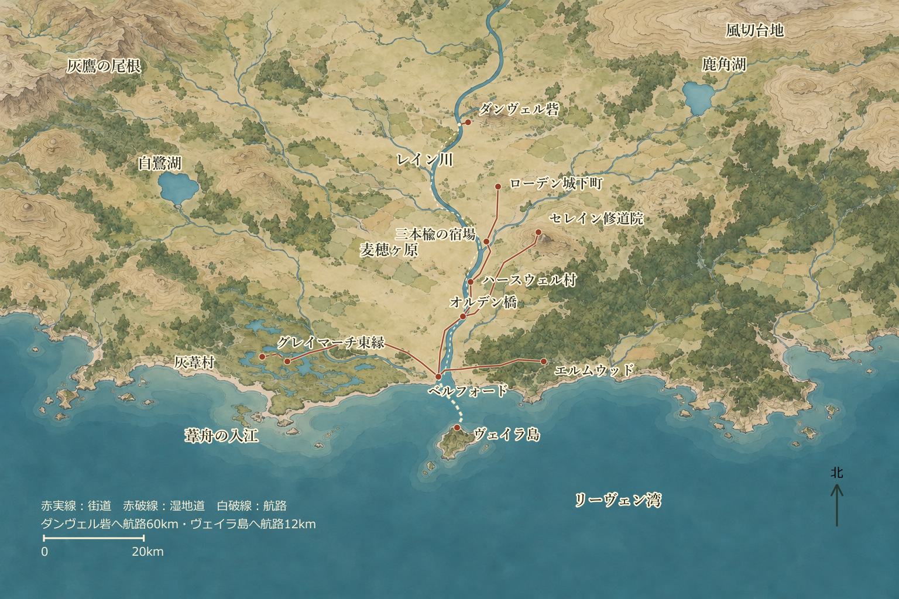

# リーヴェン湾岸

夜明け前のベルフォードでは、北の街道を目指す荷車と、沖へ帆を上げる漁船が同じ教会の鐘で動き出す。北門をくぐれば緩やかに流れるレイン川沿いに麦畑が続き、東の門を出る荷車には森へ運ぶ貴重な塩樽が積まれている。西の湿地からやってきた農夫は、昨夜の雨でぬかるんだ堤道の様子を酒場の土間に指で描いてみせる。

## REG-orientation 土地の見取り図

[地域図を拡大する](../assets/maps/lieven-illustrated-v1.svg) · [地域図の画像](../assets/maps/lieven-illustrated-v1.png)

リーヴェン湾岸は東西およそ180km、南北120kmにわたる広大な地域だ。北側にはなだらかな丘陵と豊かな農地が広がり、南はヴァルダ内海へと開けている。内陸から海へと注ぐレイン川の河口にベルフォードが位置し、東には深いエルムウッドの森、西には霧深いグレイマーチの湿地帯が横たわる。沖合の波間に浮かぶ無数の石柱群は、かつて湾を跨いでいた巨大な〈王冠橋〉の遺構だ。町の中を流れる川にかかる現役の石橋と見比べれば、そのスケールの途方もなさに誰もが息を呑む。

| ID・目的地 | 経路距離と方角 | 通常の移動時間 | 行程の目安 |
|---|---|---|---|
| REG-01 ベルフォード | 出発地点 | — | 宿、食事、装備の調達、職人への修繕依頼 |
| REG-02 オルデン橋 | 北街道 14km | 徒歩 約3時間 | 途中の荷待ち場での小休止を含め、半日の行程 |
| REG-03 ヴェイラ島 | 南の沖合 12km | 帆船 約3時間 | 潮待ちと荷積みを合わせ半日。船の手配が必要 |
| REG-04 エルムウッド | 東の街道と林道 24km | 徒歩 約6時間 | 昼食を取りながら歩いて丸一日 |
| REG-05 グレイマーチ東縁 | 西の堤道 35km | 徒歩 約8時間 | 早朝に出て夕暮れ着。余裕を見るなら途中で野営 |
| REG-06 セレイン修道院 | 北街道と北東の枝道 42km | 徒歩 約10時間 | 途中の宿場や荷待ち場を使い、通常は二日に分ける |
| REG-07 ダンヴェル砦 | レイン川上流 60km | 河船（上り15時間／下り10時間） | 川を遡るのに二日、流れに乗る下りは一日半 |
| REG-08 灰葦村 | REG-05から湿地の細道 6km | 案内人付きで約3時間 | ベルフォードから計41km、通常は二日の旅路 |

### REG-travel 街道と水路の旅路

徒歩の所要時間には、林道の曲がり角、ぬかるんだ泥道、あるいは渡し舟の待ち時間が含まれている。海路は風を捉えた小型帆船、川路は荷を積んで棹を差す頑丈な河船の標準的な速さだ。

一般的な旅のペースでは、通常の行軍で1時間に約3マイル（約4.8km）、1日に8時間歩いて約24マイル（約38km）を進む。急ぎ足で進めば早く着くが周囲の危険に気づきにくくなり、慎重に足音を忍ばせて歩けば奇襲を警戒しやすい。天候が崩れればぬかるみに足を取られ、思わぬ足止めを食うこともあるだろう。

## REG-road 北の街道と川

オルデン橋へと続く北街道には、青々とした麦畑と羊の放牧地が穏やかに広がる。この道はレイン川の東岸へ渡る交通の要所であり、橋を渡った先でセレイン修道院へと続く北東の枝道が分かれている。

ベルフォードを出て10kmほどの路傍には、板葺き屋根の素朴な共同荷待ち場がぽつりと佇む。寝床も食事の用意もない吹きさらしの小屋だが、旅人たちは井戸の冷たい水で喉を潤し、火床を囲んで互いに煙草や干し肉を分け合って夜を明かす。

丘の上に静かに建つセレイン修道院は、祈りの場であると同時に、古代の古文書を書き写す写字室や、傷病者を休ませる施療院としての役目を果たしてきた。静寂に包まれた回廊の奥には、長年堅く閉ざされたままの旧棟がひっそりと影を落としている。来訪者は門番の修道士に用向きを告げて中に入る。宿坊に泊まる者は一人一晩2SP。路銀の尽きた旅人であっても、中庭の草むしりや冬用の薪割りを半日手伝えば、温かい麦粥と乾いた藁の寝床を分けてもらえる。

レイン川を行き交う平底の河船は、上流の町から木材や石材、農作物を運び、港の塩や鉄製品と交換していく。上流に聳えるダンヴェル砦の外郭には船着場と大きな石造倉庫があり、川を行く船の重要な中継点となっている。河船に乗せてもらう場合の運賃は、ベルフォードからダンヴェル砦まで一人およそ1GPが相場だ。

## REG-inland 北街道の村と城下町

オルデン橋を渡りきると、潮の香りは次第に遠のき、干し草の匂いとパン窯から立ち上る煙が鼻をくすぐるようになる。街道沿いの宿場には、近隣の森で見かけられた怪物の噂や、丘陵の古代遺跡をめぐる知らせが集まり、近隣の村々から困りごとを抱えた使いの者がやってくる。

| 地点 | 道のり | 暮らしと旅の入口 |
|---|---|---|
| REG-09 ハースウェル村 | オルデン橋から北へ8km（ベルフォードから計22km） | 人口約350人。水車小屋、共同のパン焼き窯、のどかな羊の放牧地。村外れの古びた地下横穴を子どもたちが恐れている |
| REG-10 三本楡の宿場 | ハースウェルから北へ10km（ベルフォードから計32km） | 鍛冶屋、大きな厩、旅籠、週に一度立つ市。隊商の護衛や失せ物探し、害獣退治を頼む冒険者が集まる |
| REG-11 ローデン城下町 | 三本楡から北へ12km（ベルフォードから計44km） | 人口約2,000人。丘の上の小城、石造りの聖堂、革職人の工房街。領主の守備兵だけでは領内の隅々まで手が回らない |

三本楡の宿場にある旅籠〈牡鹿と大鍋亭〉は、街道を行く冒険者たちの溜まり場だ。女将のマルタは、初めて訪れた旅人にも温かいシチューの鍋を勧め、街道筋の仕事を取り持ってくれる。大部屋の寝床は一人一晩2SP、温かい夕食は2SP。腕のいい鍛冶職人のベンが欠けた剣や蹄鉄を打ち直し、村の薬草師リネは山から採ってきたばかりの野草を煎じて傷の手当てをしてくれる。

さらに北のローデン城下町では、酒場〈赤い牡鹿〉の黒板に、村長からの救援要請、豪商の護衛募集、聖堂からの調査依頼が所狭しと並ぶ。領主の兵は要所を守るのに手一杯で、森へ踏み込む仕事や、不気味な古い地下室の探索は、もっぱら腕利きの冒険者たちに委ねられている。

## REG-east 東のエルムウッドの森

エルムウッドは、見渡す限りの広大な原生林の名であると同時に、その林縁に寄り添う木樵たちの集落の名でもある。港へ続く林道には材木を積んだ荷車が軋む音を響かせ、村からは薪、獣肉、乾いた薬草、そして船材に欠かせない曲がり木が送り出される。

集落の共同小屋では、親切な木樵たちが旅人に夜露をしのぐ場所を貸してくれる。森の奥深くへ続く小道には、伐採の境界を示す古い刻石が立っているが、その先へは猟師たちも滅多に足を踏み入れない。森の奥の巨木には古い精霊が宿ると囁かれ、夜になると梢の間を不気味な影が飛び交うという。

## REG-west 西のグレイマーチ湿地

西のグレイマーチは、かつての大嵐によって川筋が狂い、泥と葦の原に呑まれた広大な湿地帯だ。東の縁にはかろうじて乾いた堤道が走り、渡し小屋の周りに数軒の家が集まっている。

かつて栄えていた灰葦村への6kmは、もはや道とは呼べない。腰まで浸かる浅瀬、滑りやすい泥土、朽ちかけた木道を慎重にたどらねばならない。土地勘のない者が踏み込めば、底なしの泥濘に呑まれるか、葦の陰に潜む泥怪物の餌食になるのが落ちだ。地元の案内人を頼むなら一日2GPほどで引き受けてもらえるが、彼らとて命が惜しいため、剣を抜いて戦うような危険な場所までは付き合ってくれない。

雨が降れば浅瀬は忽ち濁流と化し、堤道まで水が迫る。渡し小屋には、その朝に通れた足場の情報を知らせに、泥だらけの漁師たちが集まってくる。

## REG-sea 沖合の島と王冠橋

ベルフォードの港を出て南へ帆を走らせると、巨大な石の橋脚群が海から聳え立つ光景が迫ってくる。古代の海橋〈王冠橋〉の残骸だ。その一つ、波に洗われる孤島に**ヴェイラ島**の灯台がある。

6年前に復旧されたこの灯台は、夜毎に激しい潮流が渦巻く湾口を照らし、帰航する船団にとっての命綱となってきた。補給舟が定期的に油や食料を運んでいるが、沖合に黒雲が湧き上がると海は牙を剥く。船乗りたちは空を見上げ、出航を控えて桟橋の舫い綱を固く結び直す。

## REG-rest 帰る場所と旅路の終わり

街道や海を離れて荒野で野営するとき、旅人たちは風を遮る岩陰と清潔な湧水を探し、交代で見張りに立つ。

町を出るとき、宿の主人に行き先と戻りの予定を伝えておくのは、この土地を行く冒険者たちの習わしだ。予定の日を過ぎても戻らなければ、宿主は街道からやってきた別の旅人にそれとなく消息を尋ねる。

泥にまみれて荷車を押し、雨に打たれ、時には傷だらけになって逃げ帰る日もあるだろう。だが、無事に帰り着いた宿の扉を押せば、温かい炉の火と湯気の立つ煮込み鍋が待っている。顔馴染みの給仕が椅子を引き、笑顔で迎えてくれる――その温もりがあるからこそ、冒険者たちは再び靴紐を結び直すことができるのだ。
