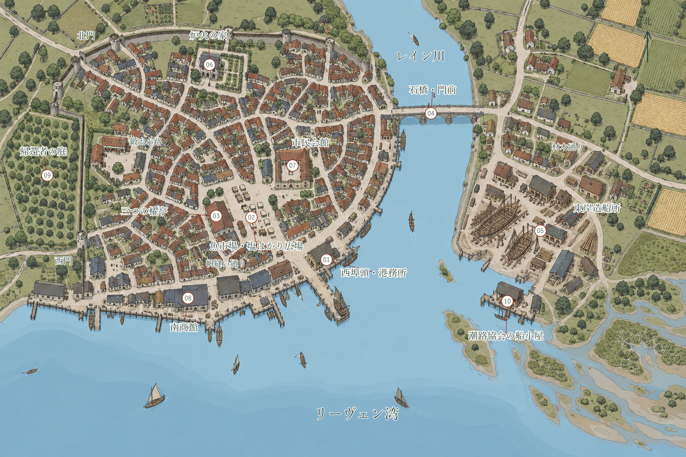

# 帰る町ベルフォード

船が波止場に着くと、至る所から呼び交わす声が響きわたる。重い麻袋を担ぎ上げる掛け声、魚の値を競り合う威勢のいい声、そして――雑踏の中に懐かしい面影を見つけ、涙声で名前を呼ぶ声。レイン川の河口に築かれた自由市ベルフォードでは、苔むした古い石橋と、真新しい松材の桟橋が、毎朝押し寄せる人波を温かく受け止めている。

ベルフォードは、大嵐の去った海に帰ってきた人々が自らの手で築き上げた、再興と開拓の港湾都市だ。東の外海から海峡を越えてやってきた帆船と、内陸の古都アルケインから街道を下ってきた荷車が、同じ広場で荷を解く。別々の土地へ逃れて育った親族が宿の卓で黄ばんだ家系図を広げ、祖父母から聞かされていた名前を震える指でなぞり合う。何十年も離れ離れだった家族が抱き合い、積もる話を語り明かす窓辺には、夜が更けてもあたたかなランプの灯がともっていた。

人口はおよそ9,000人。市民評議会が定めた「復興憲章」のもと、商人や職人、船頭たちが自らの手で町を治めている。近隣の土地にはアルケイン公国の所領が広がり、波止場や倉庫には南岸サルヴェッタの商館からの資金も流れ込む。町の治安を守る市の衛兵たちは、朝の賑やかな市場にも、黄昏時の北門にも立ち、旅人の往来を見守っている。

## CH-04-orientation 町を歩く

[市内案内図を開く](../assets/maps/belford-illustrated-v1.svg)。番号はBEL-01〜10に対応している。

市街は東西におよそ1.8km、南北に1.4kmほどの広がりを持つ。北の内陸から流れてきたレイン川が中央を貫き、南のリーヴェン湾へと注いでいる。西岸には古い街並みと活気ある市場が広がり、東岸には槌音が響く真新しい造船所が並ぶ。町の川に架かる頑丈な石橋の向こう、沖合の波間に目をやれば、失われた路面の代わりに灯台を掲げた古代の巨大橋脚群〈王冠橋〉が、悠然と海を見下ろしている。

市内の移動は、隣の地区まで歩いて10分ほど、川を渡って対岸へ行くなら20〜30分が目安だ。朝夕の市が立つ時間帯には大勢の人通りで賑わう。夜になれば港務所や酒場の軒先に明かりが灯るが、人通りの途絶えた路地裏や倉庫の陰は深い闇に包まれる。

| 地点ID | 地区・施設 | 場所と情景 | 主な役割・出会える人々 |
|---|---|---|---|
| BEL-01 | 西埠頭・港務所 | 西岸河口。船鐘の音とロープの軋み | 寄港船の把握、沖合の依頼、海の安全情報（港務官マレナ） |
| BEL-02 | 魚市場・塩はかり広場 | 港務所の北西。樽を転がす威勢のいい声 | 新鮮な魚、温かい屋台料理、町の噂話（屋台のベッサ） |
| BEL-03 | 三つの櫂亭 | 市場の西の通り。目印は赤い三本の櫂 | 乾いた寝床、温かいシチュー、冒険者の溜まり場（女将エダ） |
| BEL-04 | 石橋・北門前 | 西岸と東岸、北街道を結ぶ要所 | 荷車の往来、街道の治安、衛兵詰所（衛兵長トーリン） |
| BEL-05 | 東岸造船所 | 石橋の南東。松脂と木の削り屑の匂い | 船の修繕、頑丈な木工・鍛冶仕事（船大工サヤ） |
| BEL-06 | 炉火の家 | 旧市街北部。ハーブと焼き立てパンの香り | 傷の手当て、静かな祈り、休息（世話人ミラ） |
| BEL-07 | 市民会館 | 市場の北。鐘楼と石造りの広間 | 公的な仕事の相談、拾得物の届け出、憲章の閲覧（書記イーヴォ） |
| BEL-08 | 南商館 | 西埠頭沿い西側。荷札が並ぶ大倉庫 | 外国の珍しい品々、大口の運送契約（支配人ルーチェ） |
| BEL-09 | 帰還者の庭 | 旧市街西端。木漏れ日の差す果樹園 | 離散した家族の消息探し、過去の記憶の共有（老人バルト） |
| BEL-10 | 潮路協会の船小屋 | 東岸河口。網を繕う水夫たち | 確かな水先案内、頑丈な小舟の手配、古い海図の閲覧 |

## BEL-01 西埠頭と港務所

港務所の古びた執務室では、港務官**マレナ・ヴォス**の机の上に、寄港中の船の名を刻んだ木札が整然と並んでいる。沖合の潮の流れが変わったり、入港の知らせが届くたびに、彼女の手で木札が静かに動かされる。

航路の異変や海上の危険に関する情報は、まずここへ持ち込まれる。多忙を極めるマレナは、報告に来た者へ鋭い視線を向け、手短に要点を尋ねる。「どこで」「いつ」「誰が見たのか」。
依頼の書付には、引き受ける役目と報酬の額、貸し出される備品、そして帰港予定の日時がはっきりと記される。危険な仕事をやり遂げて戻ってきた冒険者を、マレナは窓から見届けると、船の木札の脇に救われた人々の名をそっと書き添えるのが常だ。

## BEL-02 魚市場と塩はかり広場

夜明けとともに漁師たちの競り声が響き、昼には干物や塩漬けの肉、夕暮れには持ち帰りの惣菜を売る露店がひしめく。**ベッサ・コール**の屋台からはいつも魚と根菜の煮込みの良い匂いが立ち上り、昨日の残りを安くした鍋と、今朝の獲物を使った鍋が正直に並べられている。町の噂や沖合の様子を知りたければ、空いた椀を返しがてらベッサに声をかけるのが一番の近道だ。

広場の周辺には旅の道具を商う店が揃っている。頑丈な麻縄やランプ用の油は天幕の露店で手に入り、手入れされた長剣や鎖帷子は鍛冶屋の軒先に並んでいる。一般的な冒険用の装備なら定価で買い揃えられるだろう。高価な板金鎧や特注の弓などは、職人に手付金を払って仕上がりを待つことになる。

## BEL-03 三つの櫂亭

港のすぐそばに立つ旅籠〈三つの櫂亭〉の女将**エダ・フェン**は、雨の降る日には玄関先に清潔な乾いた布を山のように用意して客を迎える。冒険者たちの持ち帰る土産話を聞くのが何よりの楽しみだが、上で疲れて眠っている船乗りのために、夜更けの度を越した馬鹿騒ぎはぴしゃりと窘める。

大部屋の寝床は一人一晩2SP、鍵のかかる二人用の個室は一晩8SP。具だくさんの煮込みと香ばしい黒パンの夕食は2SPで腹いっぱい食べられる。大切な荷物を預けておくなら、帳場に一筆書いて預け料を払えば、頑丈な地下倉庫で預かってもらえる。顔馴染みになって帰る日を伝えておけば、どれほど夜遅くに戻っても、温かい鍋の底に一人前のシチューがちゃんと残されている。

## BEL-04 石橋と北門前

市内のレイン川を跨ぐ石橋は、市民や荷車がひっきりなしに行き交う暮らしの大動脈だ。橋を渡って北へ進めば、そのままオルデン橋や内陸の村々へと続く街道へ出る。

当番の**衛兵長トーリン・ベイル**は、抜き身の刃物を持ったまま不用意に近づく者がいれば、太い声で武器を鞘に収めるよう注意を促す。だが理不尽な物言いをする男ではない。街道での怪しい人影や、廃屋で見つけた不穏な品について相談に訪れれば、トーリンは詰所の机の上を片付け、温かい茶を出してじっくりと耳を傾けてくれる。

## BEL-05 東岸造船所

新しい船台の周りには、遠い東方のミズハ諸島からやってきた船大工の頭領**サヤ**の声が響いている。地元の松材の癖を見抜き、荒波に耐える独特の継ぎ手を工夫する職人だ。言葉で長々と説明するよりも、削り出した木片を二つ並べて「ほら、ここが噛み合う」と目で納得させる。

壊れた盾の補修や、特注の木工・鍛冶仕事なら、サヤの工房に持ち込むといい。腕利きの職人たちが木と鉄の傷み具合を確かめ、必要な日数と適正な代金を教えてくれる。

## BEL-06 炉火の家

旧市街の静かな一角にある小さな施療所で、炉と客人の女神オルマの火が絶やさず守られている。世話人の**ミラ・セイン**は、荒れた海や街道から運ばれてきた怪我人の泥をぬぐい、清潔な布で手当てをする。

ミラが行うのは薬草と丁寧な看護による手当てであり、死者を蘇らせるような派手な奇跡を操るわけではない。それでも、彼女が煎じるハーブ湯と炉の温もりは、冷え切った冒険者の心身を芯から解きほぐしてくれる。手持ちの金がない怪我人であっても、体が良くなった後に薪割りや掃除を手伝う約束をすれば、温かく迎え入れてもらえる。

## BEL-07 市民会館

正面の扉には市民の手で書き上げられた「復興憲章」の写しが掲げられ、市民や旅人が仕事の取り決めや相談のために訪れる。実直な老書記**イーヴォ・レン**は、誰がどこで何を見つけて持ち込んだのかを、細いペン先で几帳面に台帳へ記録していく。

遺跡で見つかった持ち主不明の品や、公的な懸賞金の支払いはこの窓口で扱われる。文字の書けない者には口述を聞き取り、証人の立ち会いのもとでしっかりと書類を整えてくれる頼もしい窓口だ。

## BEL-08 南商館

西埠頭の突き当たり、厳重な鉄扉に守られた石造りの大倉庫が南商館だ。南岸サルヴェッタ商業同盟の代理人である支配人**ルーチェ**が、各地から届く帳簿と船荷の目録に鋭い目を走らせている。

内海の向こうからもたらされた上質な染布、香料、精緻な硝子器が並び、港では手に入らない貴重な品々の買い付けもここで行われる。ルーチェは危険を冒して貴重な品を持ち帰った冒険者に対し、商人らしい計算高さと確かな敬意をもって商談に応じてくれる。

## BEL-09 帰還者の庭

旧市街の西の端、潮風を避けるように植えられたリンゴや梨の木が広がる静かな果樹園だ。ベンチには、大嵐の時代を生き延びた老人たちや、故郷を探して旅してきた帰還者たちが集まり、日長一日語り合っている。

「うちのじいさんの家は、教会の裏手の樫の木の隣にあったはずなんだ」「その樫なら、二十年前に雷で折れちまったが、井戸はまだ残ってるよ」――失われた土地の記憶や、古い小道の手がかりを探しているなら、この庭の木陰でじっくりと長老たちの昔語りに耳を傾けてみるといい。

## BEL-10 潮路協会の船小屋

東岸の突堤に建つ潮路協会の船小屋は、海を知り尽くした老水夫や水先案内人たちの根城だ。壁には潮の干満表や、歴代の案内人たちが書き足してきた手作りの海図が貼られている。

浅瀬の多い湾口を安全に渡るための案内人を頼んだり、小回りの利く頑丈な小舟を用立ててもらうことができる。危険な海へ漕ぎ出そうとする冒険者に、彼らはパイプの煙をくゆらせながら、潮の変わり目と風の兆候をぶっきらぼうに、だが真剣に教えてくれる。
